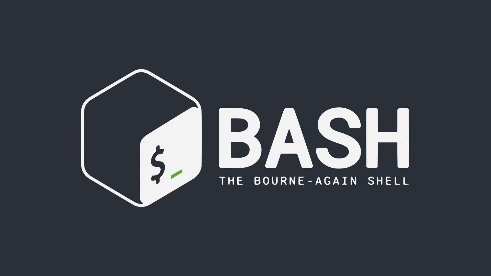

# Shell Scripts

## Table of contents
- [Overview](#Overview)

- [Results](#project-results)

## Overview
[(Back to top)](#Table-of-contents)

The repo contains a list of Shell Scripts 
for the purpose of my Docker Course :

* Script 1
* Script 2
* Script 3  

## Results

